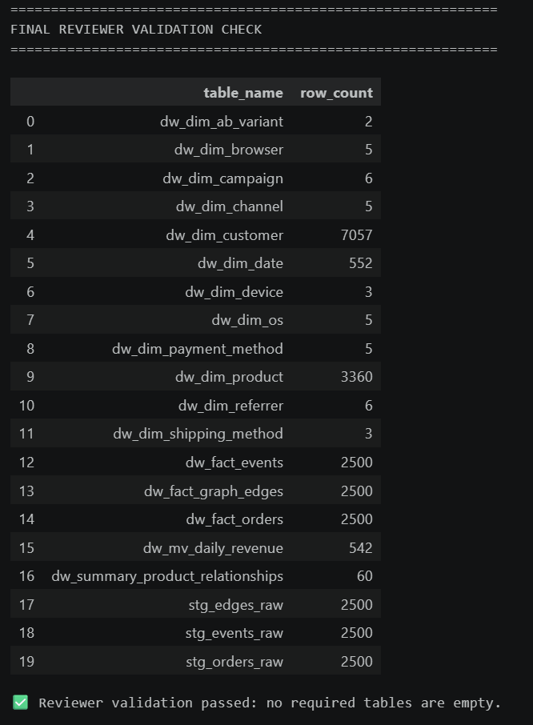
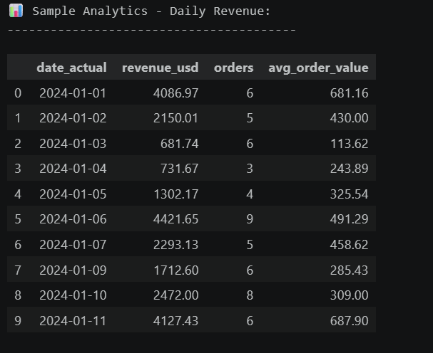
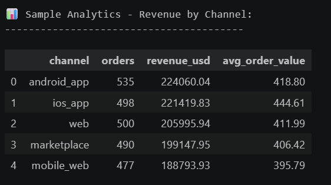
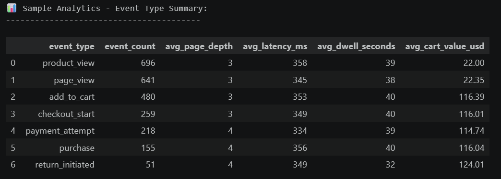
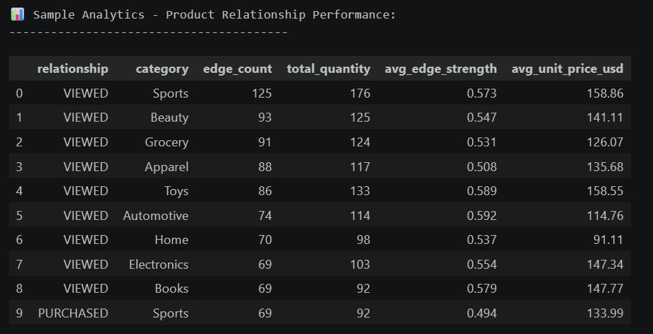

# Multi-Source E-Commerce Analytics Warehouse on Amazon Redshift

## Project Overview

This project implements a centralized analytics Data Warehouse in Amazon Redshift, integrating data from multiple heterogeneous sources: PostgreSQL, Cassandra, and Neo4j. The solution follows a star schema design and supports high-performance analytics across revenue, customer behavior, and graph-based product relationships.

## Data Sources

- PostgreSQL: Orders and transactional data
- Cassandra: Event and clickstream data
- Neo4j: Graph relationships for product recommendations

## Architecture

The pipeline consists of:

1. Data extraction from all sources
2. Loading into Redshift staging tables
3. Transformation into dimension tables
4. Population of fact tables
5. Performance optimization
6. Validation and reporting

## Warehouse Design

### Staging Tables

- stg_orders_raw
- stg_events_raw
- stg_edges_raw

### Dimension Tables

- dw_dim_date
- dw_dim_customer
- dw_dim_product
- dw_dim_campaign
- dw_dim_channel
- dw_dim_device
- dw_dim_browser
- dw_dim_os
- dw_dim_referrer
- dw_dim_shipping_method
- dw_dim_payment_method
- dw_dim_ab_variant

### Fact Tables

- dw_fact_orders
- dw_fact_events
- dw_fact_graph_edges

## Performance Optimization

- Distribution and sort keys configured
- Compression using ZSTD
- ANALYZE executed for statistics
- Materialized view for daily revenue
- Summary table for graph analytics

## Validation

The project includes:

- Row count validation
- Source-to-target reconciliation
- Data quality checks

All staging-to-fact loads preserve record counts.

## Screenshots

### Final Validation



### Daily Revenue



### Revenue by Channel



### Event Type Summary



### Product Relationship Performance



## Repository Structure

```text
.
├── starter.ipynb
├── warehouse_report.md
├── project-ddl-long.md
├── project-mermaid-diagram.md
├── screenshot/
├── data/
├── README.md
└── .gitignore
```
## Technologies

- Python
- Pandas
- PostgreSQL
- Cassandra
- Neo4j
- Amazon Redshift
- SQL
- Jupyter Notebook

## Final Report

See warehouse_report.md for full project details.

## Notes

AWS credentials are not included in this repository.

## Status

All tasks completed successfully. Data validated and pipeline corrected according to reviewer feedback.
